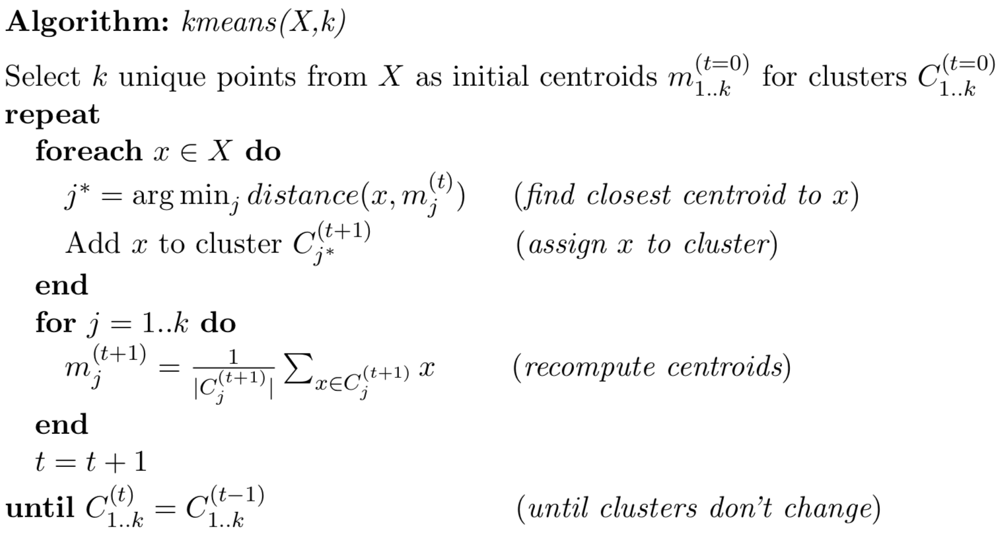

# Clustering

## Objective
The goal of the project is to implement k-means algorithm and compare its performance to other clustering algorithms. 

## kmeans
The basic kmeans algorithm:


## kmeans++
The basic idea is just to randomly pick the first of *k* centroids. Then, pick next *k*-1 points by selecting points that maximize the minimum distance to all existing cluster centroids. So for each point, compute the minimum distance to each cluster.  Among those min distances to clusters for each point, find the max distance. The associated point is the new centroid.

```
def select_centroids(X,k):
    """
    kmeans++ algorithm to select initial points:

    1. Pick first point randomly
    2. Pick next k-1 points by selecting points that maximize the minimum
       distance to all existing clusters. So for each point, compute distance
       to each cluster and find that minimum.  Among the min distances to a cluster
       for each point, find the max distance. The associated point is the new centroid.

    Return centroids as k x p array of points from X.
    """
```

## Spectral clustering

The spectral clustering is a more advanced clustering mechanism and provide better performance than kmeans.